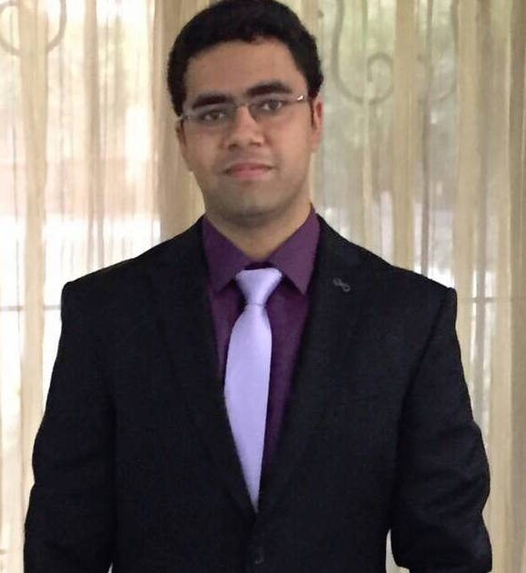

# About Us

We are a team based in the [School of Computing, National University of Singapore](http://www.comp.nus.edu.sg).

## Project Team

#### [Yoshiaki Nishimura](http://github.com/yoshi-1224)
 
* **Role**: Team lead, developer

* **Components in charge of**: [Model component](https://github.com/CS2103JAN2017-T15-B1/main/blob/master/docs/DeveloperGuide.md#24-model-component), [UI component](https://github.com/CS2103JAN2017-T15-B1/main/blob/master/docs/DeveloperGuide.md#22-ui-component)  

* **Aspects/tools in charge of**: Documentation, Deliverables and deadlines, Scheduling and tracking, Testing, Travis, Git, Javafx
* Features implemented:
* Code written: [functional code](../collated/main/A0127737X.md), [test code](../collated/test/A0127737X.md)
* Other major contributions: troubleshooting of Travis and Eclipse, Gui testing, initial refactoring

-----

#### [Brea Dionisio](http://github.com/bdioni)
 
**Role**: Developer, in charge of Logic  
**Responsibilities**: Code Quality, Integration, Eclipse expert, Git expert

-----

#### [Anshul Aggarwal](http://github.com/aanshul20)
 
**Role**: Developer, in charge of Storage  
**Responsibilities**: Testing

-----

# Contributors

We welcome contributions. See [Contact Us](ContactUs.md) page for more info.

* [Akshay Narayan](https://github.com/se-edu/addressbook-level4/pulls?q=is%3Apr+author%3Aokkhoy)
* [Sam Yong](https://github.com/se-edu/addressbook-level4/pulls?q=is%3Apr+author%3Amauris)
